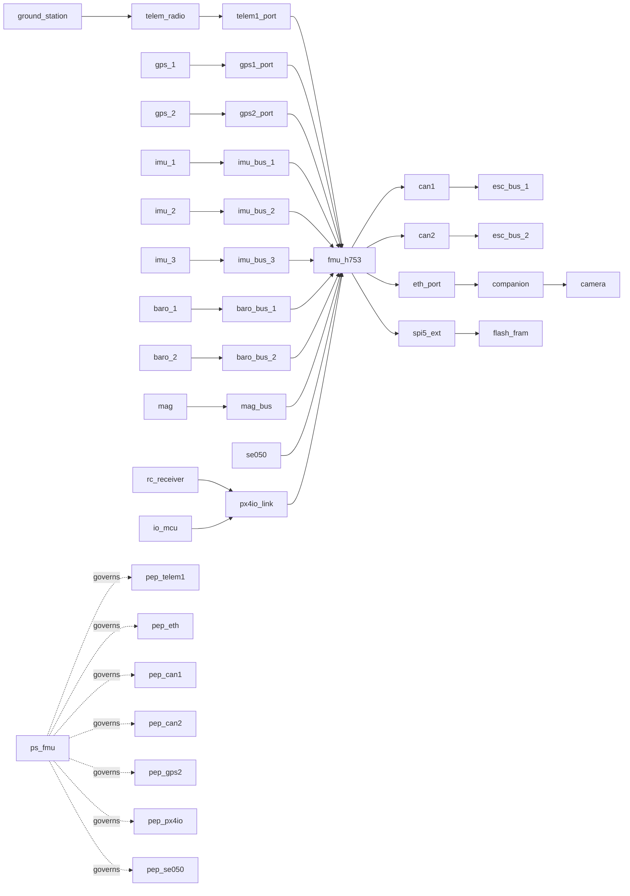

# Pixhawk 6X Model Summary

Date: April 7, 2026

## Overview

This document summarizes the Pixhawk 6X model that was added to `DSE_Core`,
including:

- the architecture captured in the model
- how the impact values were assigned
- the current Phase 1 / Phase 2 / Phase 3 analysis results

The implementation is split into two related topologies:

- `make_pixhawk6x_platform()`
- `make_pixhawk6x_uav_network()`

The platform model contains board-faithful elements only. The UAV model adds
an explicit vehicle integration overlay so that the architecture is meaningful
for end-to-end DSE analysis.

## Documentation Faithfulness

The model follows the current Pixhawk 6X documentation structure:

- `STM32H753` FMU
- dedicated IO MCU represented as `io_mcu`
- triple IMU on separate buses
- dual barometers on separate buses
- separate `GPS1` and `GPS2` ports
- `TELEM1`, `TELEM2`, `TELEM3`
- external `SPI5`
- dual `CAN`
- `Ethernet`
- board-integrated `SE050`

One documentation conflict remains open:

- PX4 and Holybro documentation disagree on the exact IO MCU silicon
- the implementation therefore uses the role-stable identifier `io_mcu`

### Additional supporting sources

The following source set was also used to cross-check the baseline model:

- PX4 Pixhawk 6X board documentation
- Holybro Pixhawk 6X technical specification
- ArduPilot Pixhawk 6X page:
  [common-holybro-pixhawk6X.rst](https://github.com/ArduPilot/ardupilot_wiki/blob/master/common/source/docs/common-holybro-pixhawk6X.rst)

The ArduPilot material does not change the baseline topology, but it does
reinforce several modeling choices:

- `GPS1` and `GPS2` are distinct ports with different roles
- `TELEM1` is the conventional high-value telemetry ingress
- `uart4_i2c_port` is a plausible UART-based RC integration point
- debug/NFC-related physical-access surfaces are real, but are currently
  documented-only rather than modeled explicitly

## Architecture Figure

## Model Structure

### Platform components

- `fmu_h753`
- `io_mcu`
- `imu_1`, `imu_2`, `imu_3`
- `baro_1`, `baro_2`
- `mag`
- `se050`
- `ps_fmu`

### Platform buses and ports

- `imu_bus_1`, `imu_bus_2`, `imu_bus_3`
- `baro_bus_1`, `baro_bus_2`
- `mag_bus`
- `gps1_port`, `gps2_port`
- `telem1_port`, `telem2_port`, `telem3_port`
- `uart4_i2c_port`
- `eth_port`
- `spi5_ext`
- `can1`, `can2`
- `px4io_link`

### UAV overlay components

- `ground_station`
- `gps_1`, `gps_2`
- `telem_radio`
- `rc_receiver`
- `esc_bus_1`, `esc_bus_2`
- `companion`
- `camera`
- `flash_fram`

### Redundancy groups

- `imu_group = {imu_1, imu_2, imu_3}`
- `baro_group = {baro_1, baro_2}`
- `gps_group = {gps_1, gps_2}`
- `motor_bus_group = {esc_bus_1, esc_bus_2}`

### Services

- `attitude_svc`
- `altitude_svc`
- `navigation_svc`
- `motor_svc`
- `comms_svc`
- `failsafe_svc`
- `crypto_svc`
- `payload_svc`
- `logging_svc`

### Capabilities

- `flight_control`
- `navigation`
- `ground_comms`
- `rc_override`
- `surveillance`
- `crypto_ops`
- `logging`

## Impact Factor Determination

The impact values were assigned using the current `DSE_Core` CIA-style asset
model and the actual role each component plays in the UAV system.

Important implementation note:

- `impact_read`, `impact_write`, and `impact_avail` are currently
  analyst-assigned values in the Pixhawk model factory
- component `exploitability` is also analyst-assigned
- the active Phase 1 multiplicative risk rule currently uses:
  - asset impact
  - selected prevention-feature exposure score
  - selected realtime-detection score
  - exploit factor derived from component `exploitability`
- component `exploitability` is exported diagnostically and is also multiplied
  into the active Phase 1 residual-risk equation through the exploit-factor map

### General method

- `impact_read`
  - used for assets that are consumed by the FMU or another master
  - highest for inertial/navigation data and trust anchors
- `impact_write`
  - used for assets that accept commands or configuration updates
  - highest for actuator and trust-anchor control paths
- `impact_avail`
  - used for denial-of-service and loss-of-function importance
  - highest for flight-critical sensing, actuation, and failsafe paths
- `exploitability`
  - higher for externally reachable interfaces
  - lower for board-internal trusted hardware

### Class-by-class rationale

#### IMUs

- `impact_read = 4`
- `impact_avail = 4`
- `exploitability = 2`

Reason:
- inertial data is essential for stabilization
- each IMU is on a separate bus and separate power-controlled sensor path
- the Rev 8 design uses same-silicon triple IMU redundancy rather than
  manufacturer diversity

#### Barometers

- `impact_read = 3`
- `impact_avail = 3`
- `exploitability = 2`

Reason:
- barometers matter for altitude control and navigation support
- they are important, but less immediately dominant than IMU data

#### Magnetometer

- `impact_read = 2`
- `impact_avail = 2`

Reason:
- useful for heading stabilization and navigation quality
- typically less mission-critical than IMU plus GPS plus barometer inputs

#### GPS receivers

- `impact_read = 4`
- `impact_avail = 4`
- `exploitability = 4`

Reason:
- navigation depends on GPS when the UAV overlay includes both external receivers
- these are external ingress points and therefore more exposed than onboard
  sensors

#### Telemetry radio

- `impact_read = 4`
- `impact_write = 4`
- `impact_avail = 4`
- `exploitability = 5`

Reason:
- `TELEM1` is the main external RF-facing communications path
- it carries command and status traffic in both directions
- it is the highest-confidence remote attack ingress in the model

#### RC receiver / PX4IO path

- `impact_read = 2`
- `impact_avail = 5`
- `exploitability = 4`

Reason:
- RC data is mainly an availability and control fallback concern
- the independent failsafe path is safety-critical
- the path is external and thus not treated as hardened

#### ESC buses

- `impact_write = 5`
- `impact_avail = 5`
- `exploitability = 2`

Reason:
- actuator command integrity and availability are directly flight-critical
- the buses are privileged outputs, not broad external ingress surfaces

#### Companion / Ethernet / camera

- `companion`: medium CIA, `exploitability = 4`
- `camera`: read-heavy payload input

Reason:
- payload functions matter, but are not primary flight-control anchors
- the Ethernet-connected companion is a high-value lateral path into the FMU

#### SE050

- `impact_read = 5`
- `impact_write = 5`
- `impact_avail = 2`
- `exploitability = 1`

Reason:
- compromise of the hardware trust anchor is severe
- direct exploitation is comparatively hard
- it is a crypto SPOF but not an externally exposed component

#### FRAM / logging storage

- `impact_read = 3`
- `impact_write = 4`
- `impact_avail = 3`

Reason:
- logging is mission-important but not as critical as control or navigation
- integrity of stored flight logs and state is more important than
  confidentiality alone

## ZTA Modeling

The current UAV model includes these candidate PEPs:

- `pep_telem1`
- `pep_eth`
- `pep_can1`
- `pep_can2`
- `pep_gps2`
- `pep_px4io`
- `pep_se050`

Current policy server:

- `ps_fmu`

The current analysis outcome shows the model strongly prefers protecting the
telemetry ingress first.

## Analysis Results

Results below are from the current implemented `Pixhawk 6X UAV` model run in
`DSE_Core` under Python 3.12.

### Phase 1 / Phase 2 / Phase 3 summary

| Strategy | Phase 1 SAT | LUTs | FFs | Power | Security Score | Resource Score | Resilience Score | Phase 2 Result |
| --- | --- | ---: | ---: | ---: | ---: | ---: | ---: | --- |
| `max_security` | yes | 25,180 | 19,230 | 507 | 73.13 | 52.67 | 44.80 | `pep_telem1`, `ps_fmu` |
| `min_resources` | yes | 17,250 | 12,740 | 338 | 32.67 | 67.58 | 44.80 | `pep_telem1`, `ps_fmu` |
| `balanced` | yes | 24,460 | 18,670 | 493 | 73.13 | 54.02 | 44.80 | `pep_telem1`, `ps_fmu` |

Resource-accounting note:

- Phase 1 `LUTs`, `FFs`, and `Power` above are added security/realtime-detection overhead
  only
- they are not the full fixed hardware cost of the Pixhawk architecture
- Phase 2 placement cost is tracked separately as `total_zta_cost`
- architecture-to-architecture comparison should therefore report:
  - architecture delta
  - Phase 1 security overhead
  - Phase 2 ZTA cost

### Phase 1 feature mix

#### `max_security`

- security:
  - `zero_trust`: 13
  - `dynamic_mac`: 3
  - `mac`: 1
- realtime detection:
  - `runtime_attestation`: 11
  - `watchdog`: 2
  - `no_realtime`: 4

#### `min_resources`

- security:
  - `zero_trust`: 6
  - `mac`: 9
  - `dynamic_mac`: 2
- realtime detection:
  - `runtime_attestation`: 2
  - `watchdog`: 7
  - `no_realtime`: 8

#### `balanced`

- security:
  - `zero_trust`: 13
  - `mac`: 4
- realtime detection:
  - `runtime_attestation`: 11
  - `watchdog`: 3
  - `no_realtime`: 3

### Baseline scenario result

For all three strategies, the baseline Phase 3 scenario was:

- satisfiable: `true`
- system functional: `true`
- services OK:
  - `attitude_svc`
  - `altitude_svc`
  - `navigation_svc`
  - `motor_svc`
  - `comms_svc`
  - `failsafe_svc`
  - `crypto_svc`
  - `payload_svc`
  - `logging_svc`
- capabilities OK:
  - `flight_control`
  - `navigation`
  - `ground_comms`
  - `rc_override`
  - `surveillance`
  - `crypto_ops`
  - `logging`

Observed baseline scenario risk:

- `max_security`: `243.0`
- `min_resources`: `600.0`
- `balanced`: `243.0`

### Worst observed scenario

Across all three strategies, the worst observed scenario in the current run was:

- `group_gps_group_compromise`

Effect:

- `navigation_svc` becomes unavailable
- capability lost:
  - `navigation`
- system functional becomes `false`

Observed worst-scenario total risk:

- `max_security`: `336.9`
- `min_resources`: `922.0`
- `balanced`: `339.0`

Worst blast radius reported in the current run:

- `35` for all three strategies

## Key Interpretation

### 1. Telemetry dominates Phase 2 placement

All three strategies placed:

- `pep_telem1`
- `ps_fmu`

This means the current model sees the telemetry path as the dominant ZTA
control point. That aligns with the modeling intent:

- external RF ingress
- bidirectional traffic
- high exploitability
- mission-essential communications role

### 2. Resource minimization materially changes the protection mix

`min_resources` reduces LUTs and power significantly:

- LUT reduction relative to `max_security`: about `31.5%`
- power reduction relative to `max_security`: about `33.3%`

But the security score drops sharply, and the worst scenario risk is much
higher.

### 3. GPS redundancy is meaningful but still a visible resilience target

The worst scenario across strategies is compromise of the GPS redundancy group.
That is useful and realistic:

- the system still has strong sensing and control structure elsewhere
- navigation remains a distinct and attackable essential function

### 4. The model behaves like a real UAV architecture

The current results already show the intended separation between:

- strong onboard sensing redundancy
- concentrated FMU governance
- a high-value telemetry ingress
- a separate RC/IO failsafe path
- a crypto anchor SPOF

## Baseline vs Revised Architecture

The first revised architecture comparison is documented in:

- [PIXHAWK6X_ARCHITECTURE_COMPARISON.md](D:\DSE\DesignSpaceExplorationforSecurity-main\DesignSpaceExplorationforSecurity-main\DSE_Core\PIXHAWK6X_ARCHITECTURE_COMPARISON.md)
- [PIXHAWK6X_CONTROL_PLANE_SENSITIVITY.md](D:\DSE\DesignSpaceExplorationforSecurity-main\DesignSpaceExplorationforSecurity-main\DSE_Core\PIXHAWK6X_CONTROL_PLANE_SENSITIVITY.md)

That comparison uses:

- baseline: `Pixhawk 6X UAV`
- revised: `Pixhawk 6X UAV (Dual-PS)`

What was added in the revised architecture:

- `ps_io`
- a link from `io_mcu` to `ps_io`
- split governance so `ps_io` becomes the candidate governor for:
  - `pep_px4io`
  - `pep_can1`
  - `pep_can2`

Why it was added:

- to test whether moving I/O and actuator protection off the single FMU-side
  policy server reduces the control-plane concentration identified in the
  baseline architecture

Important solver note:

- the Phase 2 ZTA encoding now allows `1..N` policy servers to be placed when
  a model has multiple PS candidates
- this does **not** force a multi-PS design
- it only lets the optimizer select more than one PS when that is beneficial

Observed result:

- the revised architecture is structurally different
- under the default `cost_only` objective, all three strategies still place
  only `pep_telem1` and `ps_fmu`
- under the optional `control_plane` resilience-aware objective, the revised
  dual-PS architecture places:
  - `pep_px4io`
  - `pep_can1`
  - `pep_can2`
  - `pep_telem1`
  and activates both:
  - `ps_fmu`
  - `ps_io`
- under that same `control_plane` objective, the single-PS baseline still
  places only `pep_telem1` and `ps_fmu`, and pays a non-zero Phase 2 penalty
  because safety-critical paths remain unprotected

This yields a more meaningful comparison:

- the architecture comparison framework is working
- the resilience-aware objective can now discover a dual-PS architecture
  without forcing it
- the revised design localizes `ps_fmu` compromise:
  - `pep_telem1` becomes ungoverned
  - `pep_px4io`, `pep_can1`, and `pep_can2` remain governed by `ps_io`
- the top-level worst-case risk metric does not yet improve, so the current
  benefit is localized control-plane containment rather than a broad reduction
  in global scenario risk

Weight-sensitivity note:

- the control-plane objective uses explicit penalty weights, so the dual-PS
  result should be accompanied by a sensitivity sweep
- that sweep is generated in:
  [PIXHAWK6X_CONTROL_PLANE_SENSITIVITY.md](D:\DSE\DesignSpaceExplorationforSecurity-main\DesignSpaceExplorationforSecurity-main\DSE_Core\PIXHAWK6X_CONTROL_PLANE_SENSITIVITY.md)
- in the current sweep, the qualitative behavior is identical across all three
  strategies
- the revised dual-PS architecture switches to the split-governance placement
  in `12/16` sampled weight pairs per strategy
- the observed threshold is stable in the sampled grid:
  - once the safety-critical penalty reaches `250`, the revised architecture
    selects the dual-PS split for every sampled concentration weight
- the baseline architecture never reaches a split-governance solution; it
  either stays telemetry-only or adds safety PEPs under the same single PS

## Reproducibility and Comparison Method

The current Pixhawk results are backed by reproducibility artifacts:

- checked-in golden baseline fixture:
  [pixhawk6x_baseline.json](D:\DSE\DesignSpaceExplorationforSecurity-main\DesignSpaceExplorationforSecurity-main\DSE_Core\tests\fixtures\pixhawk6x_baseline.json)
- exported generated ASP facts for direct Clingo inspection:
  - [tgt_system_pixhawk6x_platform_inst.lp](D:\DSE\DesignSpaceExplorationforSecurity-main\DesignSpaceExplorationforSecurity-main\DSE_Core\Clingo\tgt_system_pixhawk6x_platform_inst.lp)
  - [tgt_system_pixhawk6x_uav_inst.lp](D:\DSE\DesignSpaceExplorationforSecurity-main\DesignSpaceExplorationforSecurity-main\DSE_Core\Clingo\tgt_system_pixhawk6x_uav_inst.lp)
  - [tgt_system_pixhawk6x_uav_dual_ps_inst.lp](D:\DSE\DesignSpaceExplorationforSecurity-main\DesignSpaceExplorationforSecurity-main\DSE_Core\Clingo\tgt_system_pixhawk6x_uav_dual_ps_inst.lp)

For architecture comparisons, the recommended accounting method is:

- fixed architecture cost
- architecture delta cost
- added Phase 1 security/realtime-detection overhead
- added Phase 2 ZTA placement cost

This is documented in:

- [ARCHITECTURE_COMPARISON_METHOD.md](D:\DSE\DesignSpaceExplorationforSecurity-main\DesignSpaceExplorationforSecurity-main\DSE_Core\ARCHITECTURE_COMPARISON_METHOD.md)

The key implementation rule is:

- Phase 1 LUT/FF/power totals are treated as **added security overhead only**
- Phase 2 `total_cost` is treated as a separate **ZTA placement ledger**
- revised architectures should be compared with an explicit structural delta,
  not by folding architecture changes into the protection overhead totals

## Current Limitations

- The model currently uses a simplified `ps_fmu`-centric governance structure.
- Physical-access surfaces such as NFC/debug exposure are documented but not yet
  modeled explicitly.
- Power-input redundancy (`POWER1`, `POWER2`, `USB`) is not yet represented as
  a first-class redundancy group.
- The current document summarizes one implemented UAV overlay, not every
  possible Pixhawk 6X vehicle integration.

## Files

- model plan: [PIXHAWK6X_MODEL_PLAN.md](D:\DSE\DesignSpaceExplorationforSecurity-main\DesignSpaceExplorationforSecurity-main\DSE_Core\PIXHAWK6X_MODEL_PLAN.md)
- comparison method: [ARCHITECTURE_COMPARISON_METHOD.md](D:\DSE\DesignSpaceExplorationforSecurity-main\DesignSpaceExplorationforSecurity-main\DSE_Core\ARCHITECTURE_COMPARISON_METHOD.md)
- architecture comparison results: [PIXHAWK6X_ARCHITECTURE_COMPARISON.md](D:\DSE\DesignSpaceExplorationforSecurity-main\DesignSpaceExplorationforSecurity-main\DSE_Core\PIXHAWK6X_ARCHITECTURE_COMPARISON.md)
- control-plane sensitivity sweep: [PIXHAWK6X_CONTROL_PLANE_SENSITIVITY.md](D:\DSE\DesignSpaceExplorationforSecurity-main\DesignSpaceExplorationforSecurity-main\DSE_Core\PIXHAWK6X_CONTROL_PLANE_SENSITIVITY.md)
- golden baseline: [pixhawk6x_baseline.json](D:\DSE\DesignSpaceExplorationforSecurity-main\DesignSpaceExplorationforSecurity-main\DSE_Core\tests\fixtures\pixhawk6x_baseline.json)
- exported platform facts: [tgt_system_pixhawk6x_platform_inst.lp](D:\DSE\DesignSpaceExplorationforSecurity-main\DesignSpaceExplorationforSecurity-main\DSE_Core\Clingo\tgt_system_pixhawk6x_platform_inst.lp)
- exported UAV facts: [tgt_system_pixhawk6x_uav_inst.lp](D:\DSE\DesignSpaceExplorationforSecurity-main\DesignSpaceExplorationforSecurity-main\DSE_Core\Clingo\tgt_system_pixhawk6x_uav_inst.lp)
- exported revised UAV facts: [tgt_system_pixhawk6x_uav_dual_ps_inst.lp](D:\DSE\DesignSpaceExplorationforSecurity-main\DesignSpaceExplorationforSecurity-main\DSE_Core\Clingo\tgt_system_pixhawk6x_uav_dual_ps_inst.lp)
- implementation: [asp_generator.py](D:\DSE\DesignSpaceExplorationforSecurity-main\DesignSpaceExplorationforSecurity-main\DSE_Core\dse_tool\core\asp_generator.py)
- GUI registration: [network_editor.py](D:\DSE\DesignSpaceExplorationforSecurity-main\DesignSpaceExplorationforSecurity-main\DSE_Core\dse_tool\gui\network_editor.py)
- comparison helpers: [architecture_delta.py](D:\DSE\DesignSpaceExplorationforSecurity-main\DesignSpaceExplorationforSecurity-main\DSE_Core\dse_tool\core\architecture_delta.py)
- comparison report helpers: [architecture_comparison_report.py](D:\DSE\DesignSpaceExplorationforSecurity-main\DesignSpaceExplorationforSecurity-main\DSE_Core\dse_tool\core\architecture_comparison_report.py)
- tests: [test_regression.py](D:\DSE\DesignSpaceExplorationforSecurity-main\DesignSpaceExplorationforSecurity-main\DSE_Core\tests\test_regression.py)
