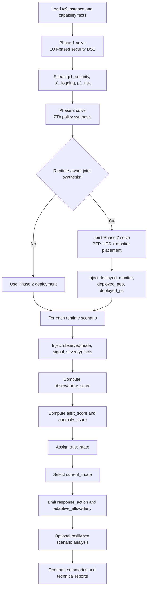

# HOST26 Runtime Algorithm Flow and Pseudocode

## Flowchart



## Pseudocode

```text
function HOST26_RUNTIME_PIPELINE():
    testcase_facts <- load testCase9_inst.lp
    phase1_files <- {
        security_features_inst.lp,
        tgt_system_tc9_inst.lp,
        init_enc.lp,
        opt_redundancy_generic_enc.lp,
        opt_latency_enc.lp,
        opt_power_enc.lp,
        opt_resource_enc.lp,
        bridge_enc.lp
    }

    phase1_model <- clingo_solve_optimal(testcase_facts + phase1_files)
    p1 <- parse_phase1_result(phase1_model)
    p1_facts <- {
        p1_security(component, feature),
        p1_logging(component, logger),
        p1_risk(asset, max_risk(asset))
    }

    phase2_model <- clingo_solve_optimal(testcase_facts + zta_policy_enc.lp + p1_facts)
    p2 <- parse_phase2_result(phase2_model)

    if runtime_joint_mode_enabled:
        joint_model <- clingo_solve_optimal(
            testcase_facts + zta_policy_runtime_enc.lp + p1_facts
        )
        joint <- parse_joint_runtime_result(joint_model)
        deployment_facts <- {
            deployed_pep(fw),
            deployed_ps(ps),
            deployed_monitor(mon)
        }
    else:
        joint <- none
        deployment_facts <- phase2_deployment_facts(p2)

    runtime_results <- []
    for scenario in RUNTIME_SCENARIOS:
        runtime_input <- {
            testcase_facts,
            runtime_monitor_tc9_inst.lp,
            runtime_adaptive_tc9_enc.lp,
            p1_facts,
            deployment_facts,
            observed(node, signal, severity) facts from scenario
        }

        runtime_model <- clingo_solve_optimal(runtime_input)
        runtime_result <- parse_runtime_result(runtime_model)
        runtime_results.append(runtime_result)

    if resilience_phase_enabled:
        resilience_results <- []
        for scenario in RESILIENCE_SCENARIOS:
            resilience_input <- {
                testcase_facts,
                resilience_tc9_enc.lp,
                p1_risk facts,
                deployed PEP / PS facts,
                compromised(node) and failed(node) facts
            }
            resilience_model <- clingo_solve(resilience_input)
            resilience_results.append(parse_resilience_result(resilience_model))

    return p1, p2, joint, runtime_results, resilience_results
```

## Runtime Scoring Logic

```text
monitor_visibility(node) = max strength among deployed monitors covering node
logging_visibility(node) = 0 / 6 / 15 depending on Phase 1 logger
observability_score(node) = monitor_visibility(node) + logging_visibility(node)

alert_score(node) = sum over observed signals:
    signal_weight(signal) * severity

base_score(node) = sum of static penalties caused by:
    missing attestation
    unsigned policy server
    missing hardware root of trust
    missing secure boot
    missing key storage on high-domain receivers

anomaly_score(node) = base_score(node) + alert_score(node) + observability_score(node)

if anomaly_score >= 100:
    trust_state = compromised
else if anomaly_score >= 70:
    trust_state = low
else if anomaly_score >= 40:
    trust_state = medium
else:
    trust_state = high

if any trust_state == compromised:
    current_mode = attack_confirmed
else if any safety-critical receiver or active policy server has low trust:
    current_mode = attack_confirmed
else if any node has medium or low trust:
    current_mode = attack_suspected
else:
    current_mode = normal
```

## Joint Runtime Objective

```text
maximize response_readiness_score
maximize detection_strength_score
minimize weighted_detection_latency
minimize false_positive_cost
minimize monitor_total_cost
```

This matches the implemented order in `Clingo/zta_policy_runtime_enc.lp`.
